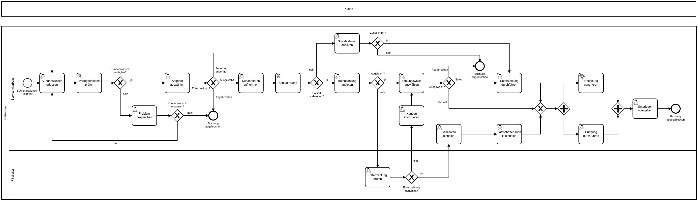

# Hotelbuchung in Camunda BPM
## Ziel
Ausführung eines BPMN-Prozesses zum Thema "Hotelbuchung" in dem Workflow-Management-System [Camunda BPM](https://camunda.com/products/) im Rahmen einer Projektarbeit der Technischen Hochschule Brandenburg. 

## Herangehensweise
Folgende Abschnitte werden vom Projektteam agil bearbeitet:

| Nr | Task | Status |
|----|------|------|
|1.    |Konzeptionierung eines Hotelbuchungsprozess      |✅    |
|2.   |Modellierung des Prozesses in Kombination Skript- und Service-Tasks      |✅      |
|3.    |Integration und Anpassung einer beispielhaften Hotelbuchungs-API      |✅      |
|4.    |Dokumentation in Form eines Projekberichts      |🔁      |

Legende: ✅ Fertig, 🔁 In Bearbeitung, 🔴 Offen

## Werkzeuge
- [Camunda Modeler](https://camunda.com/download/modeler/) zur Modellierung des BPMN-Prozesses
- [Camunda BPM](https://camunda.com/download/) als Workflow-Management-System
- [REST-API über Express.js](https://expressjs.com/de/) als Buchungs-API
- [Visual Studio Code](https://code.visualstudio.com/) für Entwicklung der API (JS), Skript-Tasks (Groovy) und Service-Tasks (JS)

## Aktueller Prozess

